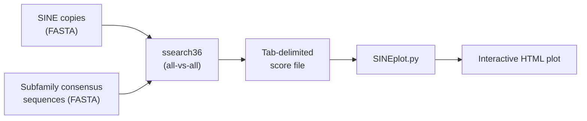
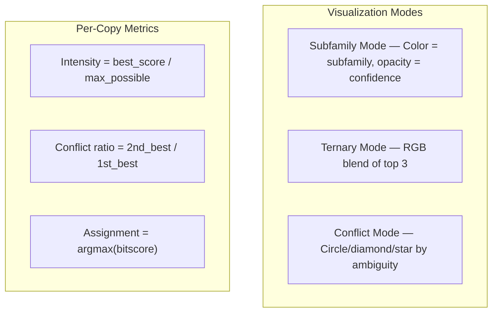

# SINEplot

Interactive 2D visualizer for SINE transposon subfamily classification. Takes raw `ssearch36` bitscores, positions each SINE copy in a 2D space based on its similarity to reference subfamily consensuses, and produces an interactive HTML plot.

## What it does

Each SINE copy in your dataset is scored against every subfamily consensus. SINEplot uses those raw bitscores to:

1. **Position subfamily centers** via MDS (multidimensional scaling) on a pairwise distance matrix derived from inter-subfamily alignment scores
2. **Position each SINE copy** as a weighted centroid — pulled toward the subfamilies it matches, with the pull strength proportional to bitscore
3. **Assign** each copy to its best-matching subfamily, compute confidence (best score / max possible) and a **conflict ratio** (2nd-best / 1st-best) to flag ambiguous assignments
4. **Render** everything as an interactive Plotly scatter plot with three visualization modes

## Workflow



## Generating the input data

SINEplot reads the tabular output of [FASTA36's ssearch36](https://github.com/wrpearson/fasta36). You need two FASTA files:

| File | Contents |
|------|----------|
| **Subfamily consensuses** | One sequence per subfamily. Names must be short (< 15 chars), e.g. `dD`, `dE`, `sq2_Bsal`. These become the reference axes. |
| **SINE copies** | Genomic SINE copies extracted from your species. Names are typically locus coordinates. |

Concatenate them into a single FASTA, then run ssearch36 in all-vs-all mode with tabular output:

```bash
# Combine into one file
cat subfamilies.fa copies.fa > all_sines.fa

# All-vs-all alignment with tabular output (field 12 = bitscore)
ssearch36 -m 8 -T 4 all_sines.fa all_sines.fa > scores.txt
```

The `-m 8` flag produces BLAST-style tab-delimited output. SINEplot reads **field 12 (bitscore)** from each line and keeps the maximum bitscore per (query, subject) pair.

### Input format

Each meaningful line must have at least 12 whitespace-separated fields. The parser uses fields 1 (query), 2 (subject), and 12 (bitscore):

```
dD        copy_chr3:1504322  100.00  180  0  0  1  180  1  180  2.1e-50  195.0
dD        copy_chr7:892101    87.22  180  23 0  1  180  1  180  1.3e-38  153.2
dE        copy_chr3:1504322   72.11  176  49 0  1  176  3  178  8.7e-21   89.4
```

Lines containing `working`, `Cycle`, `[INFO]`, `searching`, `cat`, or `(base)` are skipped as noise from pipeline logs.

### How subfamilies are detected

Short query names (< 15 characters) that appear as queries in more than 5 alignments are classified as subfamily consensuses. Everything else is treated as a SINE copy. Self-alignments (e.g. `dD` vs `dD`) are used to calibrate the maximum possible score for each subfamily.

## Installation

```bash
pip install pandas numpy plotly scikit-learn
```

Python 3.8+.

## Usage

```bash
# Basic — produces sine_interactive.html
python SINEplot.py scores.txt

# Custom output and title
python SINEplot.py scores.txt -o my_plot.html -t "Python SINE subfamilies"

# Limit displayed points (large datasets)
python SINEplot.py scores.txt --max-points 500

# Geometric layout instead of MDS
python SINEplot.py scores.txt --mode geometric

# DBSCAN clustering for very large datasets
python SINEplot.py scores.txt --cluster
```

### Full options

| Flag | Default | Description |
|------|---------|-------------|
| `input` | *(required)* | ssearch36 tabular output file |
| `--mode` | `phylo` | Layout: `phylo` (MDS from scores) or `geometric` (even circle) |
| `-o, --output` | `sine_interactive.html` | Output HTML file path |
| `-t, --title` | `SINE Bitscore Distribution` | Plot title |
| `--color-mode` | `subfamily` | Initial color mode: `subfamily` or `ternary` |
| `--max-points` | `1000` | Max points to display (auto-adjusted for datasets > 10k) |
| `--cluster` | off | Use DBSCAN clustering instead of random downsampling |

## Visualization modes

The output HTML has three toggle-able visualization modes accessible via buttons on the plot:

### Subfamily Mode

Each SINE copy is colored by its assigned subfamily. Opacity encodes confidence — a bright, opaque dot has a high bitscore relative to the subfamily's self-score; a translucent dot is a weak match.

### Ternary Mode

For the top 3 subfamilies, each copy gets an RGB color blended from its relative affinity. A copy equally matching two subfamilies appears as a color mix (e.g., red+blue = purple). Useful for seeing gradient transitions between subfamilies.

### Conflict Mode

Shows assignment ambiguity. Each copy gets a shape and color based on the **conflict ratio** — how close the 2nd-best subfamily score is to the 1st-best:

| Tier | Conflict ratio | Marker | Meaning |
|------|----------------|--------|---------|
| **Solid** | < 0.50 | 🟢 circle | Best hit dominates by 2×+, clear assignment |
| **Moderate** | 0.50 – 0.85 | 🔶 diamond | Runner-up is competitive, worth reviewing |
| **Ambiguous** | ≥ 0.85 | 🔴 star | Near-tie, assignment is statistically unreliable |

The legend shows counts per tier. Toggle tiers on/off — e.g. hide "Solid" to isolate gray-zone copies.



## Interactive features

- **Hover** any dot to see its sequence ID, assigned subfamily, confidence, conflict ratio, runner-up subfamily, and all raw bitscores
- **Click legend items** to toggle subfamily/tier visibility
- **Box or lasso select** to copy selected sequence names to clipboard
- **Dot size slider** to adjust marker size for dense or sparse plots
- **Scroll/pinch** to zoom, **drag** to pan, **double-click** to reset view
- **Reset Legend** button restores all hidden groups

## Console output

The script prints comprehensive statistics:

```
============================================================
COMPREHENSIVE STATISTICS
============================================================

Assignment Conflict Distribution:
  Solid      (ratio < 0.50):   4821 (72.3%)
  Moderate (0.50 -  0.85):   1432 (21.5%)
  Ambiguous    (>= 0.85):    414 ( 6.2%)
  Mean conflict ratio:   0.387
  Median conflict ratio: 0.312

dD: 3200 SINEs (48.0%)
  Average similarity: 67.2%
  Range: 12.1% - 98.4%
  Median: 71.3%
  ...
```

## Example

Given a dataset of ~2,000 SINE copies scored against three subfamily consensuses (`dD`, `dE`, `dF`):

```bash
python SINEplot.py dDEF_scores.txt -o dDEF_plot.html -t "dD/dE/dF subfamily assignment"
```

**Subfamily Mode** — tight clusters around each subfamily center, with scattered intermediate copies between them:

```
        dE (blue)
        ● ●●●
       ● ●●●●●
        ● ●● ●
         ◇         ← copy with moderate conflict (between dE and dD)
    
                ★   ← ambiguous copy (near-equal to dD and dF)
    
  dD (red)              dF (green)
  ●●●●●●               ●●●●●
  ●●●●●●●●             ●●●●●●
  ●●●●●●               ●●●●
```

**Conflict Mode** on the same data — same positions, but now colored by ambiguity:

```
        dE
        ● ●●●           ● = Solid (green)
       ● ●●●●●          ◇ = Moderate (orange)
        ● ●● ●          ★ = Ambiguous (red)
         ◆
    
                ★
    
  dD                  dF
  ●●●●●●               ●●●●●
  ●●●●◆●●●             ●●●◆●●
  ●●●●●●               ●●●●
```

Copies near cluster centers are Solid. Copies between clusters — especially equidistant from two subfamilies — show up as Moderate or Ambiguous, highlighting zones where subfamily boundaries are unclear.

## How positioning works

1. **Subfamily distance matrix**: For each pair of subfamilies, distance = average self-score − best cross-score
2. **MDS**: The distance matrix is embedded into 2D via metric MDS, producing subfamily center coordinates
3. **SINE placement**: Each copy is positioned at a weighted centroid of all subfamily positions, weighted by raw bitscore. A dominance-ratio blending factor pulls strong matches closer to their best subfamily and lets conflicted copies float in between
4. **Downsampling**: For datasets > `max-points`, a stratified sampler keeps top/bottom/random copies from each subfamily to preserve cluster shape

## License

MIT
